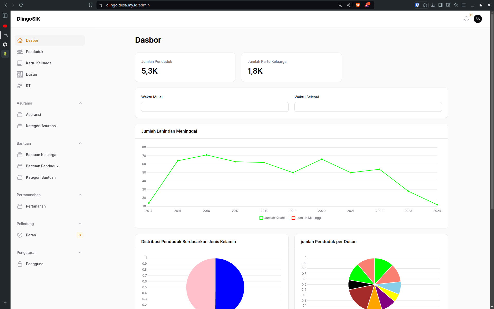
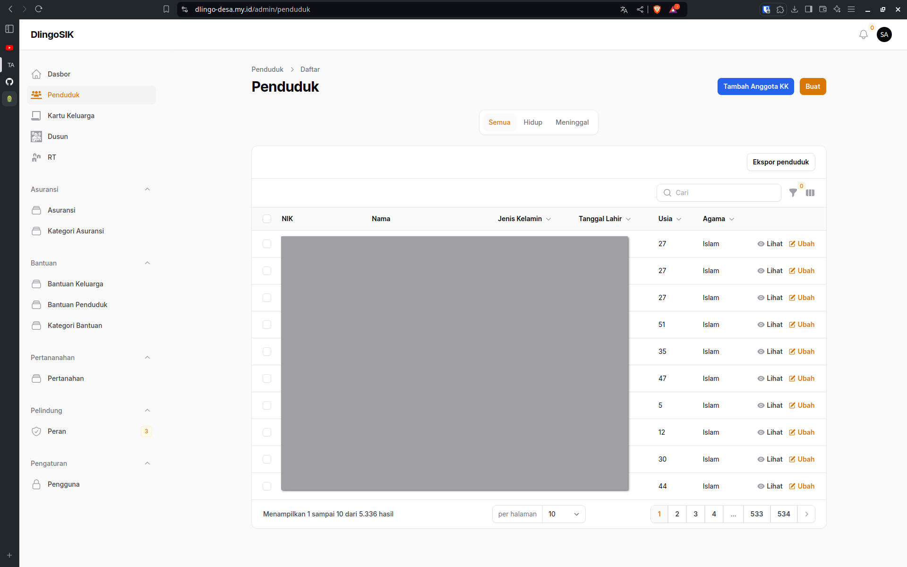
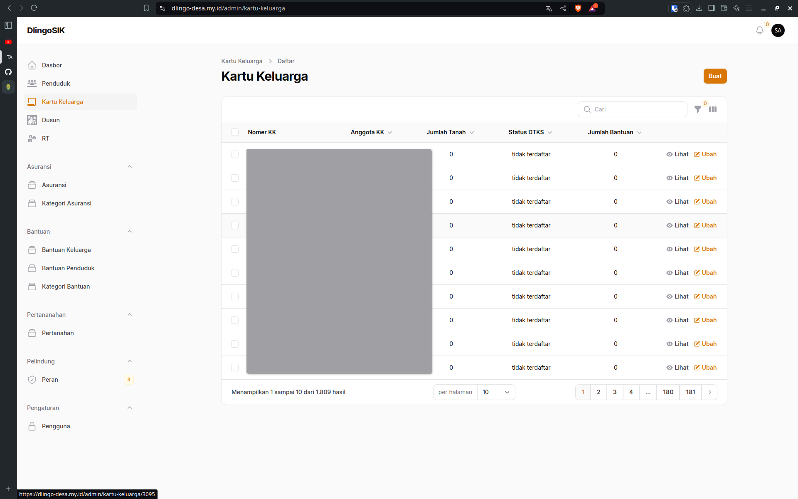
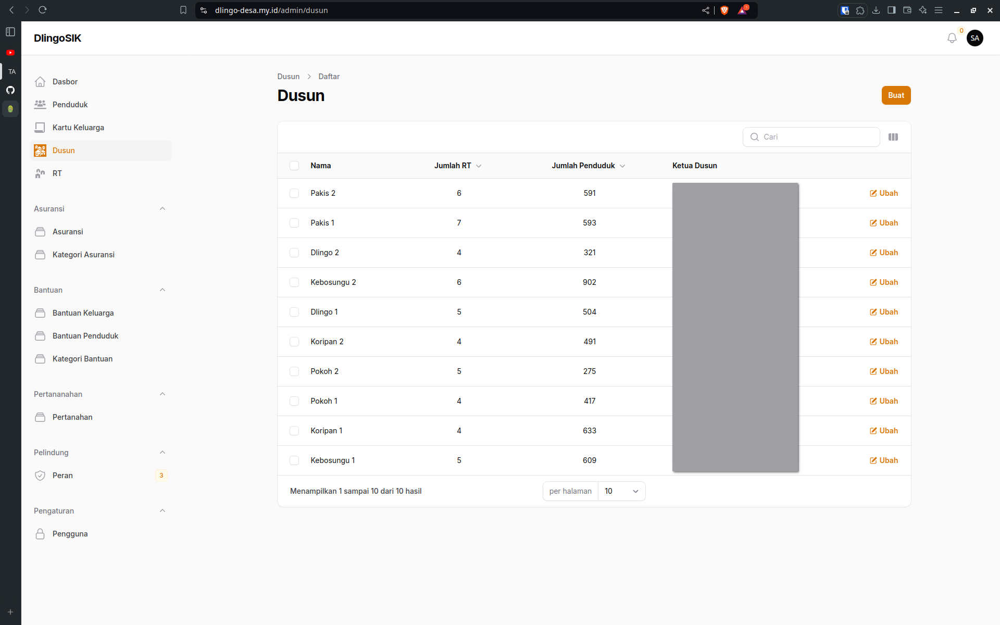
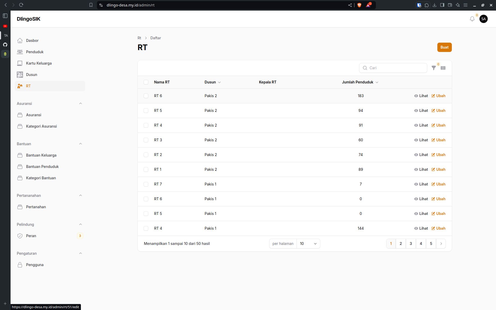

<p align="center"><a href="https://dlingo-desa.my.id" target="_blank"></a></p>

## Preview

<p align="center"><a href="https://dlingo-desa.my.id" target="_blank"></a></p>
<p align="center"><a href="https://dlingo-desa.my.id" target="_blank"></a></p>
<p align="center"><a href="https://dlingo-desa.my.id" target="_blank"></a></p>
<p align="center"><a href="https://dlingo-desa.my.id" target="_blank"></a></p>
<p align="center"><a href="https://dlingo-desa.my.id" target="_blank"></a></p>

## Deployment
compress
```bash
tar -czvf dlingo-sik.tar.gz dlingo-sik
```
extract
```bash
tar -xzvf nama.tar.gz
```